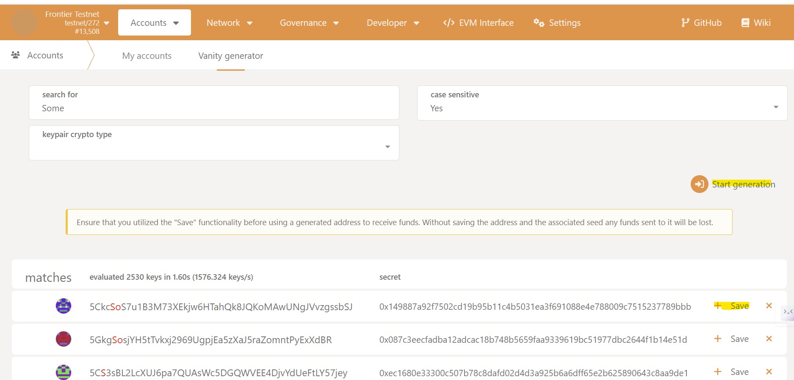
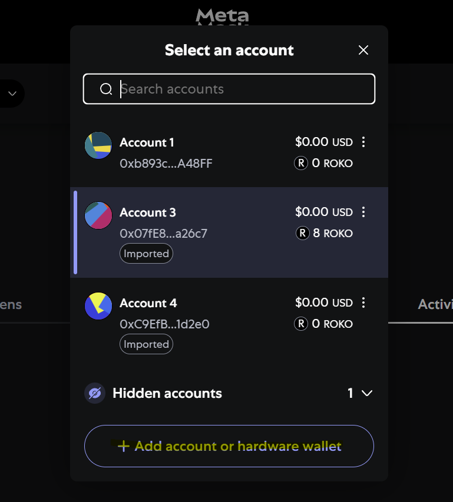
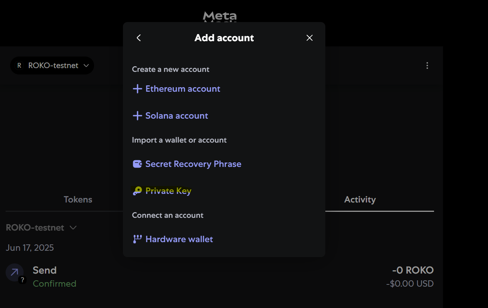
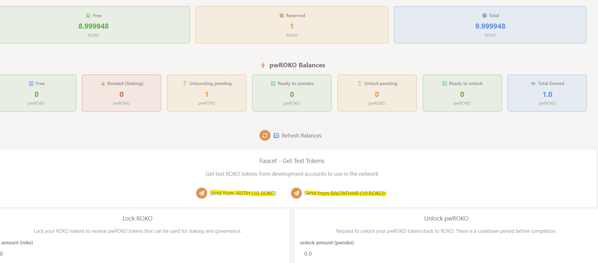
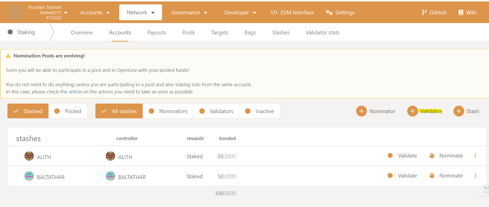
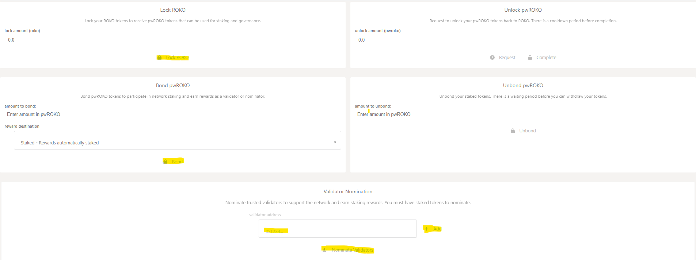

# ROKO Network Validator Node Setup Guide

This guide walks you through setting up and running a validator node for the ROKO Network testnet. It covers dependency installation, building the node, generating keys, running the validator, and staking via both the Polkadot.js and EVM interfaces.

---

## 1. Prerequisites

- Docker installed
- **Disk**: ≥ 20 GB free space
- **RAM**: ≥ 8 GB
- **Network**: Open ports 30333 (p2p) and 9944 (RPC)

---

## 2. Create the Container Folder and Set Permissions

   ```bash
   mkdir -p $HOME/data && chmod 777 $HOME/data
   ```

---

## 3. Download the Docker Compose File

Download the validator docker-compose configuration file:

**[📥 Download docker-compose.yml.validator](https://raw.githubusercontent.com/ROKO-Network/ROKO-docs/main/docker-compose.yml.validator)**

Save this file in your working directory.

---

## 4. Configure Your Docker Compose File

1. **Set your password and index in your docker-compose file (line 8 and 9):**
   
   The password and index are used to generate all keys for the node that are needed to run the node

   ```yml
   - SESSION_KEYS_PASSWORD=your_password
   - INDEX=0
   ```


2. **Change the name of your validator on line 18 of the docker compose file:**
   
   ```yml
   "--name", "YOUR-VALIDATOR-NAME",
   ```

**Note:** If you want to change the container folder, don't forget to modify the volumes parameters in your docker-compose file.

---

## 5. Run the Validator Node and Verify It's Running

1. **Start the node:**
   
   ```bash
   docker-compose -f docker-compose.yml.validator up -d
   ```

2. **Verify that it's running:**

   ```bash
   docker-compose -f docker-compose.yml.validator logs -f
   ```

---

## 6. Create & Fund Your Account

### 6.1 Generate an Address (Roko Explorer)

1. Open [roko-explorer.ntfork Apps](https://roko-explorer.ntfork.com/#/accounts/vanity)
2. Click **Accounts → Vanity generator → Start generation → Save** and follow the wizard.



### 6.2 Import to EVM Wallet

1. Copy your private key from roko-explorer.
2. In MetaMask or Rabby, choose **Import Account** and paste the key.




---

## 7. Connect to EVM Interface & Get Test Tokens

1. Navigate to the ROKO EVM interface.
2. Use the faucet to request ROKO from **Alith** or **Baltathar** (each has 100 ROKO).



Then go to **Lock & Mint**, select **ROKO → pwROKO**, and lock your tokens.

---

## 8. Stake & Set Session Keys (Polkadot.js)

1. In Polkadot.js, switch to **Network → Staking → Accounts**.
2. Click **+ Validator**, select your account, and set the amount to bond.
3. Paste the session keys generated by your node using this command on your node computer:

   ```bash
   curl -s -H "Content-Type: application/json" -d '{"id":1,"jsonrpc":"2.0","method":"author_rotateKeys","params":[]}' http://localhost:9944
   ```

4. Confirm and submit the transaction.



---

## 9. Delegate Tokens to the Validator

Back in the EVM interface, repeat the same process as before: lock ROKO, bond it, then go to **Delegate**, choose your validator's address, and confirm.



---

**End of Guide**

